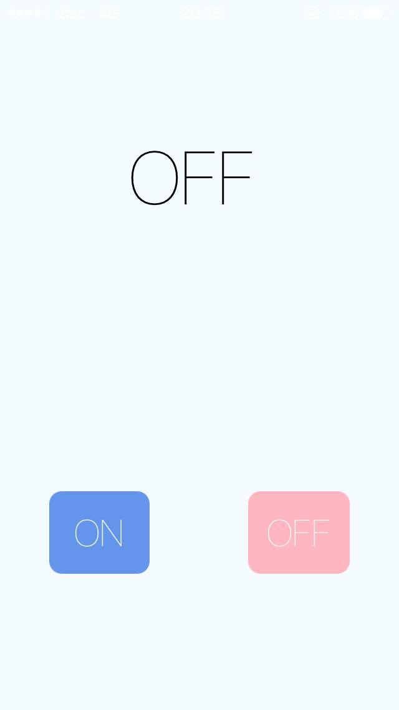

# วิธีการ Fork แอปพลิเคชันที่ได้จากลิงค์


  หลังจากที่เราได้ลิงค์ของแอปพลิเคชั่นมาเรียบร้อยแล้วถ้าเราอยากที่จะแก้ไขแอปพลิเคชั้นให้เป็นของเราให้ทำดังขั้นตอนดังต่อไปนี้


                    รูปแสดงแอปพลิเคชั่นตัวอย่างที่ได้มา
                                                 
  
  
  กดปุ่ม Fork เพื่อนำแอปพลิเคชั่นดังกล่าวมาใช้งานเป็นของเราเพื่อทำการแก้ไขและพัฒนาในส่วนที่ต้องการ
  
  
  
  
หลังจากที่กดปุ่ม Fork แล้วยังไม่ได้ทำการสมัครสมาชิก React Native Playground ให้ทำการ Sign Up ก่อนสำหรับในการสร้างแอปพลิเคชั่น

เมื่อเราทำการสมัครสมาชิกเรียบร้อยแล้วหน้าเว็ปเพจจะทำการ Redirect มายังหนัา  rnplay.org 


ให้เรากลับไปที่แอปพลิเคชั่นที่จะทำการนำมาพัฒนาอีกครั้งนึงแล้วทำการกด Fork

หลังจากทำการกด Fork เราก็จะสามารถพัฒนาแอปพลิเคชั่นได้ตามต้อง(ถ้ายังไม่ได้กด Fork จะไม่สามารถแกไขได้โดยดูจากชื่อแอปพลิเคชั่นมุมบน้ายจะมีชื่อเจ้าของแอปพลิเคชั่นอยู่)


สำหรับการเปลี่ยนชื่อแอปพลิเคชั่นนั้นให้เราสังเกตในส่วนที่เป็น ```class ReactNativeSimple extends Component``` ในส่วนหัวและ ```AppRegistry.registerComponent('ReactNativeSimple', () => ReactNativeSimple);```  


ให้ทำการเปลี่ยนชื่อ ReactNativeSimple เป็นชื่อตามที่เราต้องการและเมื่อทำการเปลี่ยนชื่อเสร็จให้ทำการกด Fork อีกที นึงเพื่อเป็นการ Register ชื่อของแอปพลิเคชั่นนั้น แล้วเราก็จะได้ Mobile Application ขึ้นมาเป็นของตัวเองแล้ว โดยสามารถรันผ่าน IOS หรือว่า Android ก็ได้ ผ่านทาง QR CODE โดยกดที่ Run on Your Device 



